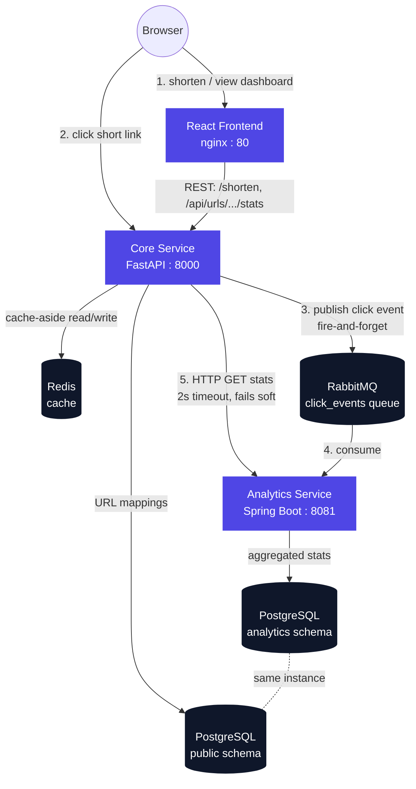
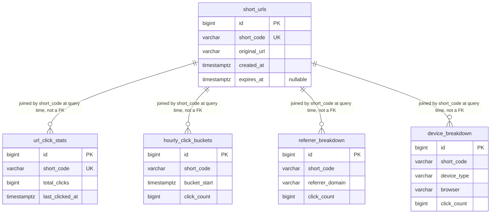

# Distributed URL Shortener with Real-Time Analytics

A full-stack, polyglot distributed system: a Python/FastAPI service handles URL
shortening and redirects behind a Redis cache, a Java/Spring Boot service
consumes click events off RabbitMQ and aggregates them into real-time
analytics, and a React dashboard polls and visualizes the result. Built to
demonstrate distributed-systems fundamentals - caching strategy, async
event-driven decoupling, service-to-service HTTP calls with graceful
degradation, and containerized orchestration - not just CRUD.

**Live numbers, not claims:** 72 automated tests (49 Python, 23 Java), a
Locust load test that caught and fixed a real concurrency bug (see
[load-tests/RESULTS.md](load-tests/RESULTS.md)), and a 5-job CI pipeline
verified green on GitHub Actions.

## Screenshots

*(placeholder - add screenshots of the shorten page and dashboard here)*

## Architecture



**Request flow for a redirect:** browser hits `GET /{short_code}` →
core-service checks Redis first → on hit, redirects immediately and returns;
on miss, queries Postgres, populates the cache, then redirects → either way,
publishes a click event to RabbitMQ as a background task *after* the response
is sent, so a slow/down queue never delays the redirect. Analytics-service
consumes that event asynchronously, completely decoupled from the request
that generated it.

## Why this architecture

**Why a separate analytics service, not just a table core-service writes to
directly?** The redirect path is the one piece of this system that can never
be slow or unavailable - every click goes through it. Aggregation logic
(parsing user agents, bucketing into hourly windows, building breakdowns) is
real work that has no business running synchronously inside a redirect. Two
services means analytics-service can be slow, redeploying, or fully down
without affecting a single redirect. The tradeoff is eventual consistency:
click counts lag reality by however long the queue + consumer take to catch
up (typically sub-second locally) - an acceptable tradeoff for analytics,
not for the redirect itself.

**Why Redis caching on the redirect path?** Once a short URL is resolved, the
mapping never changes (no edit endpoint exists), which makes it an ideal
cache-aside candidate - hits never go stale. Postgres is queried once per
short code (cold) and never again until the TTL expires, which is the entire
point of the cache: redirects are the hot path, and the *whole reason* this
architecture document exists is to make that path fast.

**Why RabbitMQ over Redis pub/sub for click events?** Redis pub/sub is
fire-and-forget - a subscriber that's down when a message is published loses
it permanently. RabbitMQ queues are durable: messages persist until acked,
so analytics-service can crash or redeploy and still catch up afterward
without losing data. The cost is a heavier container than Redis pub/sub
would add (~150-200MB), trivial for a docker-compose demo.

**Consistency vs. latency, explicitly:** the `/api/urls/{code}/stats`
endpoint calls analytics-service synchronously over HTTP with a tight
timeout (connect capped at 0.5s - see the comment in
[`analytics_client.py`](core-service/app/services/analytics_client.py)
explaining a real bug this caught: a naive single-float timeout doubled to
~4s under IPv4/IPv6 dual-stack connection attempts). If analytics-service is
unreachable, the endpoint degrades gracefully - it returns core-service's
own data with zeroed analytics and `"analytics_available": false`, rather
than failing the whole request. Verified end-to-end, not just asserted: see
[Step 6/7 verification][verification].

[verification]: #testing

**Sync vs. async, explicitly:** the dashboard polls every 5 seconds rather
than using WebSockets. A WebSocket implementation needs connection-lifecycle
management and (if this ever scaled past one instance) a pub/sub fan-out
layer just to broadcast a number that changes a few times a minute - more
infrastructure than the property (a few seconds of staleness is fine)
justifies.

## Tech stack

| Component | Language / Framework | Purpose |
|---|---|---|
| core-service | Python 3.13, FastAPI, SQLAlchemy 2.0, Pydantic v2 | URL shortening, cached redirects, click-event publishing, stats aggregation endpoint |
| analytics-service | Java 21, Spring Boot 3.3, Spring Data JPA, Spring AMQP | Consumes click events, aggregates stats, serves them over REST |
| frontend | React 18, Vite, React Router, Recharts | Shorten UI, live-polling analytics dashboard with charts |
| Database | PostgreSQL 16 | Persistent storage - `public` schema (core-service), `analytics` schema (analytics-service), same instance |
| Cache | Redis 7 | Cache-aside layer for the redirect hot path |
| Message queue | RabbitMQ 3.13 (management image) | Durable, async click-event delivery from core-service to analytics-service |
| Load testing | Locust | Concurrent-request simulation against the redirect endpoint |
| CI | GitHub Actions | Python tests, Java tests, frontend build, Docker image builds, optional Docker Hub push |
| Orchestration | Docker Compose | One-command full-stack startup, with a `dev` override for hot-reload |

## Features

- Shorten any valid HTTP(S) URL to a 7-character base62 code, with
  collision-safe random generation (retries on collision, not ID-encoding -
  see code comments for why)
- Optional custom alias (3-30 chars, validated format, 409 on conflict)
- Optional expiry date - expired links return `410 Gone` and are never served
  from cache past their expiry
- Redis-cached redirects (cache-aside, TTL capped at a link's expiry)
- Async click-event pipeline: timestamp, user-agent, referrer, IP, all
  captured without adding latency to the redirect itself
- Real aggregation: total clicks, hourly buckets (daily rolled up from
  hourly at query time), device/browser breakdown (hand-rolled UA parser),
  referrer domain breakdown
- Cross-service stats endpoint with graceful degradation when
  analytics-service is unreachable
- React dashboard: shorten page with copy-to-clipboard, link list with
  live (5s-polled) click counts, detail view with bar + pie charts
- Fully Dockerized with a separate hot-reload dev compose override

## Setup

### Prerequisites

- Docker Desktop (with WSL2 backend on Windows)
- For individual-service development: Python 3.13, Java 21 + Maven, Node 20

### Run everything with one command

```bash
git clone https://github.com/mahetab1357/url-shortener.git
cd url-shortener
cp .env.example .env
docker compose up -d
```

This builds and starts all 6 services: Postgres, Redis, RabbitMQ,
core-service (`:8000`), analytics-service (`:8081`), frontend (`:5173`).
RabbitMQ's management UI is at `:15672` (guest/guest - fine for local use,
**do not** expose this externally with default credentials).

```bash
curl http://localhost:8000/health
docker compose ps   # all should show "healthy" or "Up"
```

Open `http://localhost:5173` in a browser.

### Development mode (hot reload)

```bash
docker compose -f docker-compose.yml -f docker-compose.dev.yml up --build
```

- core-service: `uvicorn --reload` against a bind-mounted `app/`
- analytics-service: `mvn spring-boot:run` with Spring Boot DevTools - note
  DevTools restarts on compiled `.class` changes, not raw `.java` edits, so
  you need a `mvn compile` (or IDE auto-compile) against the same mounted
  source to actually see a reload
- frontend: real `vite dev` server with HMR, on `:5173` directly

### Running each service individually (no Docker)

**core-service:**
```bash
cd core-service
python -m venv .venv && source .venv/Scripts/activate  # .venv\Scripts\activate on cmd
pip install -r requirements-dev.txt
cp .env.example .env   # edit DATABASE_URL etc. if not using Docker's Postgres
python -m app.db.init_db
uvicorn app.main:app --reload
```

**analytics-service:**
```bash
cd analytics-service
mvn spring-boot:run
```

**frontend:**
```bash
cd frontend
npm install
cp .env.example .env.local
npm run dev
```

## API documentation

All examples assume core-service at `http://localhost:8000` and
analytics-service at `http://localhost:8081`.

### `POST /shorten`

Create a short URL.

```bash
curl -X POST http://localhost:8000/shorten \
  -H "Content-Type: application/json" \
  -d '{"url": "https://example.com/some/long/path"}'
```

```json
{
  "short_code": "aPaUa0D",
  "short_url": "http://localhost:8000/aPaUa0D",
  "original_url": "https://example.com/some/long/path",
  "created_at": "2026-06-29T07:23:09.123Z",
  "expires_at": null
}
```

Optional fields: `custom_alias` (3-30 chars, `[A-Za-z0-9_-]`), `expires_at`
(ISO 8601, must include a timezone offset).

```bash
curl -X POST http://localhost:8000/shorten \
  -H "Content-Type: application/json" \
  -d '{
    "url": "https://example.com",
    "custom_alias": "my-cool-link",
    "expires_at": "2026-12-31T23:59:59Z"
  }'
```

| Status | Meaning |
|---|---|
| 201 | Created |
| 422 | Malformed URL or invalid alias format |
| 409 | Custom alias already taken |
| 503 | Could not allocate a random short code after 5 attempts (practically never - 62^7 ≈ 3.5 trillion combinations) |

### `GET /{short_code}`

Redirect to the original URL.

```bash
curl -i http://localhost:8000/aPaUa0D
```

```
HTTP/1.1 307 Temporary Redirect
location: https://example.com/some/long/path
```

`307` (not `301`) deliberately - a `301` gets cached indefinitely by
browsers, which would mean future clicks never reach core-service at all,
breaking click tracking and the ability to expire/update a link.

| Status | Meaning |
|---|---|
| 307 | Redirect |
| 404 | Unknown short code |
| 410 | Link has expired |

### `GET /api/urls/{short_code}/stats`

Aggregated stats for a short URL - core-service's own data merged with a
live call to analytics-service.

```bash
curl http://localhost:8000/api/urls/aPaUa0D/stats
```

```json
{
  "short_code": "aPaUa0D",
  "original_url": "https://example.com/some/long/path",
  "created_at": "2026-06-29T07:23:09.123Z",
  "expires_at": null,
  "total_clicks": 3,
  "last_clicked_at": "2026-06-29T20:35:38.478595Z",
  "hourly_clicks": [{"hour_start": "2026-06-29T20:00:00Z", "count": 3}],
  "daily_clicks": [{"date": "2026-06-29", "count": 3}],
  "device_breakdown": [{"device_type": "Desktop", "browser": "Chrome", "count": 3}],
  "referrer_breakdown": [{"referrer_domain": "direct", "count": 3}],
  "analytics_available": true
}
```

If analytics-service is unreachable, this still returns `200` with
`total_clicks: 0` and `"analytics_available": false`, rather than failing.

### `GET /health`

```bash
curl http://localhost:8000/health
# {"status":"ok"}
```

### analytics-service: `GET /api/analytics/{shortCode}/stats`

The raw endpoint core-service calls internally (camelCase JSON, since it's
Java/Jackson - core-service translates this to snake_case before returning
it to the frontend). Returns zeroed stats (not 404) for an unknown code,
since analytics-service doesn't own short-code validity.

```bash
curl http://localhost:8081/api/analytics/aPaUa0D/stats
```

### analytics-service: `GET /actuator/health`

```bash
curl http://localhost:8081/actuator/health
# {"status":"UP"}
```

## Database schema



`short_urls` lives in Postgres's `public` schema, owned exclusively by
core-service. The four analytics tables live in a separate `analytics`
schema, owned exclusively by analytics-service - same physical Postgres
instance for this project's scale, but no foreign keys cross the schema
boundary, and no service queries the other's tables directly. They're
joined only logically, by `short_code`, and only inside application code
(core-service calling analytics-service over HTTP) - this is what makes it
safe for either service's schema to change independently.

Schema creation: core-service runs `python -m app.db.init_db`
(`Base.metadata.create_all`) once at container start, not on every request -
see the comment in `app/db/init_db.py` for why coupling schema creation to
app boot was tried first and reverted. analytics-service creates its
`analytics` schema via `schema.sql` then lets Hibernate's `ddl-auto: update`
create tables inside it. Both are dev-appropriate shortcuts; a production
system would use Alembic (Python) and Flyway/Liquibase (Java) migrations
instead - see Future Improvements.

## Testing

### Unit + integration tests

```bash
# Python (49 tests)
cd core-service
source .venv/Scripts/activate
pytest -v

# Java (23 tests)
cd analytics-service
mvn test
```

Python tests run against an in-memory SQLite DB and `fakeredis` rather than
real Postgres/Redis - a deliberate tradeoff for millisecond-fast CI feedback
over perfect environment parity; Postgres/Redis-specific behavior is
exercised by the Docker Compose integration testing below, not pytest. The
RabbitMQ publisher tests use a fake channel/connection rather than a real
broker, including a concurrency regression test
(`test_publish_serializes_concurrent_calls_across_threads`) for a real bug
caught by load testing (next section).

Java tests include a `@DataJpaTest` integration test against a real H2
database (Postgres-compatibility mode) proving the aggregation logic's
read-then-increment counters actually accumulate correctly across multiple
events - not just that mocked repository methods get called.

### Full-stack integration (Docker Compose)

```bash
docker compose up -d
curl -X POST http://localhost:8000/shorten -H "Content-Type: application/json" \
  -d '{"url": "https://example.com/test"}'
# take the short_code from the response, then:
curl http://localhost:8000/<short_code>
curl http://localhost:8000/api/urls/<short_code>/stats
# total_clicks should reflect the real RabbitMQ -> analytics-service pipeline
```

### Load testing

```bash
cd load-tests
python -m venv .venv && source .venv/Scripts/activate
pip install -r requirements.txt
locust -f locustfile.py --host=http://localhost:8000 --headless \
    -u 100 -r 10 --run-time 60s --csv results --html results.html
```

**Result summary** (100 concurrent users, 60s, full results and a real bug
this caught in [load-tests/RESULTS.md](load-tests/RESULTS.md)):

| Metric | Value |
|---|---|
| Total requests | 9,855 |
| Failures | 0 (0.00%) |
| Throughput | 166 req/s |
| Median latency | 230ms |
| p95 latency | 330ms |
| p99 latency | 390ms |

The first run of this test caught a real concurrency bug: ~98% of click
events were silently failing to publish under load
(`pika.exceptions.ChannelWrongStateError`, from a `BlockingConnection`
shared unsafely across FastAPI's thread pool) - invisible at the HTTP layer
since the redirect path is designed to never fail on a queue problem. Fixed
with a lock, verified with both a new regression test and by re-running the
load test and confirming click counts in Postgres. Full writeup in
[load-tests/RESULTS.md](load-tests/RESULTS.md) - this is the kind of bug
that doesn't show up without genuine concurrent load.

## Folder structure

```
url-shortener/
├── core-service/          # Python/FastAPI - shortening, redirects, cache, queue publishing
│   ├── app/
│   │   ├── routers/       # /shorten, /{short_code}, /api/urls/.../stats
│   │   ├── services/      # short-code generation, caching, click events, analytics client
│   │   ├── models/        # SQLAlchemy ORM models
│   │   ├── schemas/       # Pydantic request/response models
│   │   ├── db/            # engine/session, explicit schema init
│   │   └── mq/            # RabbitMQ publisher
│   └── tests/
├── analytics-service/      # Java/Spring Boot - consumes events, aggregates, serves stats
│   └── src/main/java/com/urlshortener/analytics/
│       ├── controller/     # REST endpoint
│       ├── service/        # aggregation logic, UA/referrer parsers, RabbitMQ listener
│       ├── repository/     # Spring Data JPA repositories
│       └── model/          # JPA entities
├── frontend/               # React/Vite - shorten page + dashboard
│   └── src/
│       ├── pages/           # ShortenPage, DashboardPage
│       ├── components/      # charts, link cards, copy button
│       ├── hooks/            # polling, localStorage-backed link list
│       └── api/               # backend HTTP client
├── load-tests/             # Locust load test + recorded results
├── .github/workflows/      # CI pipeline
├── docker-compose.yml       # production-target stack
└── docker-compose.dev.yml   # hot-reload overrides
```

## Future improvements

- **Migrations instead of `create_all`/`ddl-auto: update`** - Alembic for
  core-service, Flyway/Liquibase for analytics-service, so schema changes
  are versioned and reviewable instead of implicit
- **User accounts** - the dashboard currently tracks "your" links via
  browser `localStorage` since there's no auth system; real accounts would
  move this server-side and enable proper per-user link ownership
- **Geo-IP lookup** - click events capture the raw client IP but
  deliberately don't resolve it to a location synchronously (would add
  external-API latency to every redirect); a future enrichment step could
  resolve IPs to country/city asynchronously, off the request path
- **Rate limiting** on `/shorten` to prevent abuse
- **Custom domains** for shortened links
- **Link expiry cron job** to purge expired rows instead of leaving them in
  the table indefinitely (they already 410 correctly, just aren't deleted)
- **Negative caching** for 404s on the redirect path, to absorb
  scan/enumeration traffic without hitting Postgres every time
- **Dead-letter queue** for click events that fail to process in
  analytics-service, instead of logging and dropping them
- **Horizontal scaling of analytics-service** - its aggregation logic
  currently relies on a single sequential RabbitMQ consumer thread for
  correctness (read-then-increment, not atomic upserts); multiple replicas
  would need atomic `ON CONFLICT` upserts or row-level locking instead
- **Swap the hand-rolled user-agent parser** for a maintained library
  (e.g. `uap-java`) for broader real-world UA coverage

## License

MIT
